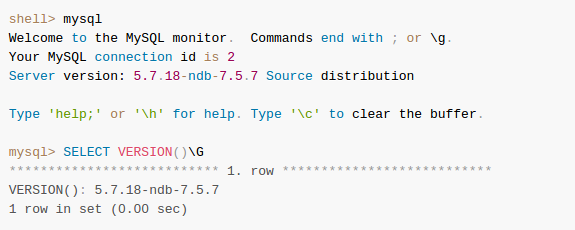
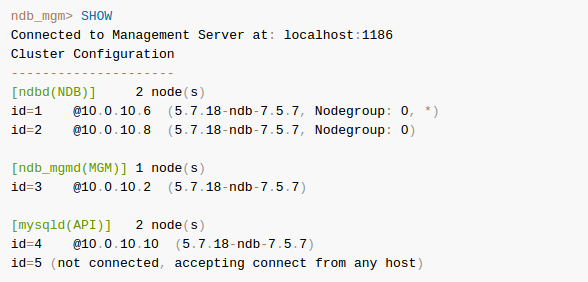

# High Availability SQL data

MySQL is deployed into many applications demanding availability and scalability. Availability refers to the ability to cope with, and if necessary recover from, failures on the host, including failures of MySQL, the operating system, or the hardware and maintenance activity that may otherwise cause downtime. Scalability refers to the ability to spread both the database and the load of your application queries across multiple MySQL servers. Because each application has different operational and availability requirements, MySQL offers a range of certified and supported solutions, delivering the appropriate levels of High Availability and scalability to meet service level requirements.

The primary solutions supported by MySQL include [[REF]](https://dev.mysql.com/doc/mysql-ha-scalability/en/ha-overview.html):
- MySQL Replication
- MySQL Fabric
- **MySQL NDB Cluster 7.5 and NDB Cluster 7.6**
- Oracle MySQL Cloud Service
- Oracle Clusterware Agent for MySQL
- MySQL with Solaris Cluster

## MySQL NDB
MySQL NDB Cluster is a **high-availability**, high-redundancy version of MySQL adapted for the distributed computing environment. Recent NDB Cluster release series use version 7 of the NDB storage engine (also known as NDBCLUSTER) to enable running several computers with MySQL servers and other software in a cluster.

NDB Cluster 7.5, now available as a General Availability (GA) release beginning with version 7.5.4, incorporates version 7.5 of the NDB storage engine.

NDB Cluster 7.6, which uses version 7.6 of the NDB storage engine, is also now available as a developer preview.

Support for the NDB storage engine is not included in standard MySQL Server 5.7 binaries built by Oracle. Instead, users of NDB Cluster binaries from Oracle should upgrade to the most recent binary release of NDB Cluster for supported platforms—these include RPMs that should work with most Linux distributions. NDB Cluster users who build from source should use the sources provided for NDB Cluster. (Locations where the sources can be obtained are listed later in this section.)

> ```Although an NDB Cluster SQL node uses the mysqld server daemon, it differs in a number of critical respects from the mysqld binary supplied with the MySQL 5.7 distributions, and the two versions of mysqld are not interchangeable.```

This version string is also displayed in the output of the SHOW command in the ndb_mgm client:




NDB cluster management console



### Limitations
Known [limitations](https://dev.mysql.com/doc/refman/5.7/en/mysql-cluster-limitations.html) of NDB cluster.


## Galera cluster
Galera Cluster is a synchronous multi-master database cluster, based on synchronous replication and Oracle’s MySQL/InnoDB. When Galera Cluster is in use, you can direct reads and writes to any node, and you can lose any individual node without interruption in operations and without the need to handle complex failover procedures [[REF]](http://galeracluster.com/documentation-webpages/index.html "Galera").


## MariaDB Galera Cluster
MariaDB Galera Cluster is a synchronous multi-master cluster for MariaDB. It is available on Linux only, and only supports theXtraDB/InnoDB storage engines (there is experimental support for MyISAM, see the wsrep_replicate_myisam system variable). Starting with MariaDB 10.1, the wsrep API for Galera Cluster is included by default.

### Features

- Synchronous replication
- Active-active multi-master topology
- Read and write to any cluster node
- Automatic membership control, failed nodes drop from the cluster
- Automatic node joining
- True parallel replication, on row level
- Direct client connections, native MariaDB look & feel

