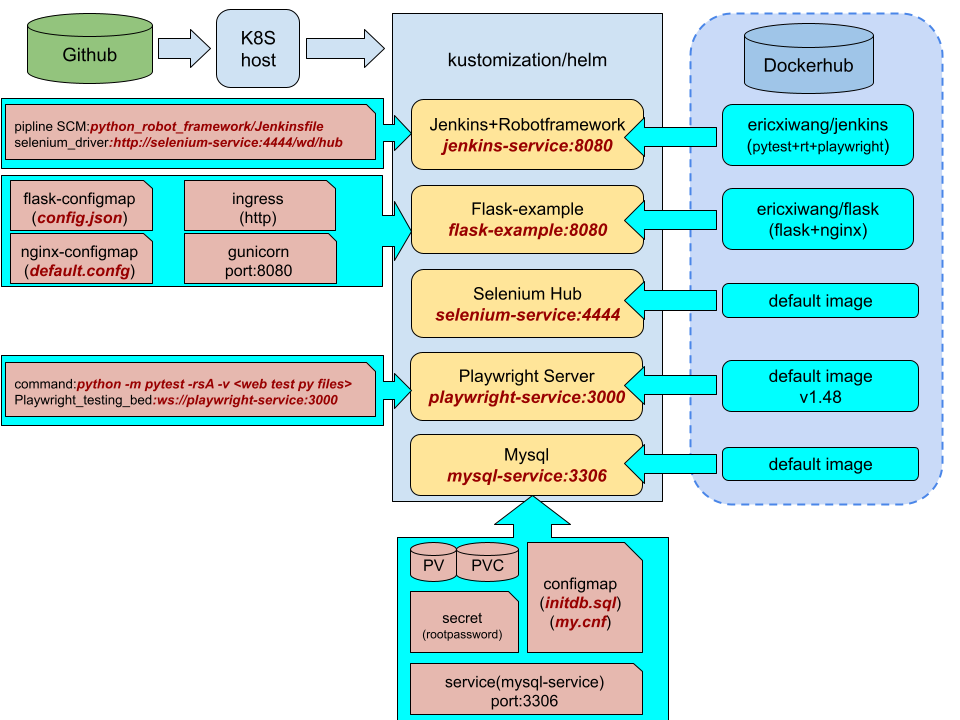

## k8s based CI/CD basic demo

___
## Git sub folder summary(Docker Image)
### 1. python_flask 
```
flask web application(web+APIs) + Dockerfile
docker pull ericxiwang/flask:tagname
```
### 2. python_robot_framework(Docker Image)
```
Jenkins server + RobotFramework + test suite + Dockerfile
docker pull ericxiwang/jenkins:tagname
```

## Git sub folder summary(K8S config)
### location
    DevOps/k8s/12_kustomization
### 1.flask-nginx
    service name: flask-example
    service port: 8080
### 2.jenkins-selenium
    service name: jenkins-service
    service port: 8080
### 3.mysql
    service name: mysql-service
    service port: 3306
### 4.selenium-service
    service name: selenium-service
    service port: 4444
### 5.playwright-service
    service name: playwright-service
    service port: 3000
#### run port forward on k8s
    kubectl port-forward --address=0.0.0.0 service/jenkins-service（jenkins-server） 8081:8080 & \
    kubectl port-forward --address=0.0.0.0 service/selenium-service 4444:4444 & \
    kubectl port-forward --address=0.0.0.0 service/flask-example 8080:8080 & \
    kubectl port-forward --address=0.0.0.0 svc/playwright 3000:3000 &

#### k8s sketch map
___

___